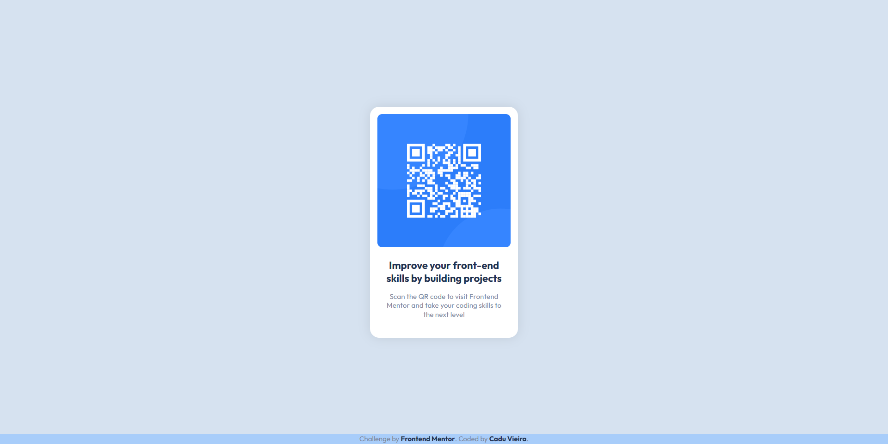

# Frontend Mentor - QR code component solution

This is a solution to the [QR code component challenge on Frontend Mentor](https://www.frontendmentor.io/challenges/qr-code-component-iux_sIO_H). Frontend Mentor challenges help you improve your coding skills by building realistic projects. 

## Table of contents

- [Overview](#overview)
  - [Screenshot](#screenshot)
  - [Links](#links)
- [My process](#my-process)
  - [Built with](#built-with)
  - [What I learned](#what-i-learned)
  - [Useful resources](#useful-resources)
- [Author](#author)

## Overview

### Screenshots




### Links

- [Solution URL](https://www.frontendmentor.io/solutions/qr-code-component-Ss4Fq0eSWp)
- [Live site URL](https://frontendmentor-qr-code-component-main-bice.vercel.app/)

## My process

### Built with

- HTML
- CSS

### What I learned

Casting a shadow around an object.

```css
 main {
  box-shadow: 0 0 25px rgba(0, 0, 0, 0.1);
 }
```

### Useful resources

- [PowerToys](https://learn.microsoft.com/pt-br/windows/powertoys/) - PowerToys was very useful for measuring all the elements of the original design provided by Frontend Mentor. I used the ScreenRuler tool.

## Author

- Frontend Mentor - [@caduovieira](https://www.frontendmentor.io/profile/caduovieira)
- LinkedIn - [@carloseduardovieira](https://www.linkedin.com/in/carlos-eduardo-vieira-37b991154/)

